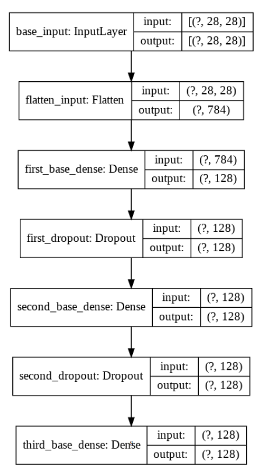
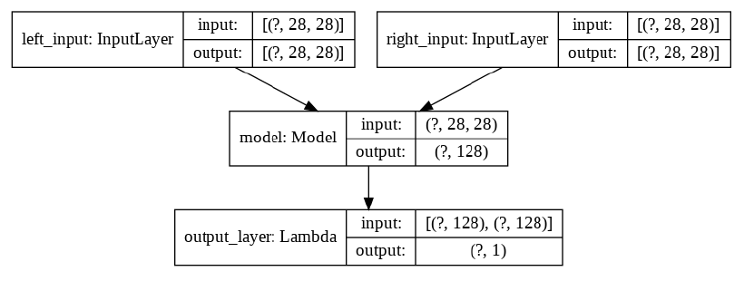
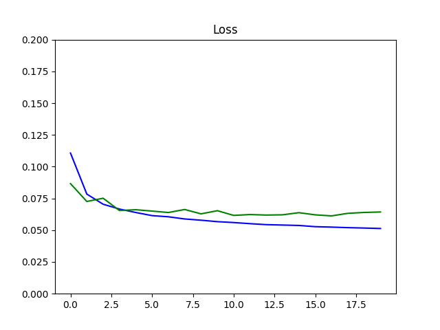
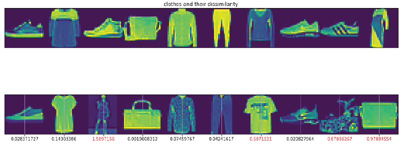

# Custom_loss & Custom_layer

## 1) Custom loss function in Siamese network  
In this repository, I implemented Siamese Network with custom loss function "contrastive_loss".  
By running 'SiameseNetwork_customLoss.py' code, you can see the structure of model like below:  

  

and the whole model as below which takes two image inputs and check the dissimilarity of the pair :  

  

  

After finishing the training part, droping of loss on training set and evaluation set is: 

  

Ten random samples of paired data with their dissimilarity values seem like below image. More closer to 0 means more similarity. Those pairs with more than 0.5 value are colored red.  

## 2) Custom layer  
